<div align="center">


# Mohamed Alaaser

**Software Engineer · Full-Stack · Mobile**

Building production systems from embedded hardware to cloud — currently shaping **Vehicle-to-Grid (V2G)** at **The Mobility House Energy** while pursuing an **MSc in Informatics @ TUM**.

[](https://www.linkedin.com/in/mohamed-alaaser-b05b60183/)
[](mailto:mohamed.s.alaaser@icloud.com)
[](https://mohamedalaaser.com)

<br />

[](https://git.io/typing-svg)

<br />

📍 Munich, Germany · 🎓 TUM Informatics · 📱 **5** live apps on App Store / Play Store

</div>

---

## 👋 About

```typescript
const mohamed = {
  role: "Software Engineer @ The Mobility House Energy",
  focus: ["Full-Stack", "Mobile", "Energy & V2G", "Polished UX"],
  education: "MSc Informatics @ Technical University of Munich",
  location: "Munich, Bavaria, Germany",
  currentlyLearning: ["V2G integration", "Security & Privacy", "Robotics"],
  funFact: "Built everything from FPGA smart homes to App Store apps — solo.",
};
```

Passionate about **elegant, user-centric software**. I work comfortably across the stack — from **Flutter & React** frontends to **Node, Java, and cloud infra** — with a soft spot for native-feeling mobile experiences and production-grade energy products.

---

## 🔭 Currently

- ⚡ Integrating **Vehicle-to-Grid (V2G)** and bidirectional charging at **The Mobility House Energy**

---

## 🛠 Tech Stack

<p align="center">
  
</p>

<p align="center">
  
  
  
  
  
  
</p>

---

## ⭐ Featured Projects

| Project | Description | Stack |
| :--- | :--- | :--- |
| [**Gym Tracker**](https://github.com/mohamedalaaser/gym_tracker) | iOS-first workout logger with native UI, home widgets & Live Activities | `Flutter` `Dart` `Swift` |
| [**JARVIS**](https://github.com/mohamedalaaser/jarvis) | Voice AI assistant with holographic 3D stage, memory & MCP tools | `Next.js` `Claude` `Three.js` |
| [**Uni'd Food**](https://github.com/mohamedalaaser/Uni-dFood) | Campus food ordering — customer app, restaurant app & admin portal · **Live on App Store & Play Store** | `Flutter` `Node.js` `AWS` |
| [**Module-Management**](https://github.com/ls1intum/Module-Management) | Open-source contributor to TUM's university module management platform | `TypeScript` `Angular` |
| [**Smart Home**](https://github.com/mohamedalaaser/SmartHome) | IoT automation with FPGA (VHDL), sensors & Flutter Bluetooth control | `Flutter` `VHDL` `FPGA` |
| [**HearthStone Clone**](https://github.com/mohamedalaaser/HearthStone-Clone) | Two-player turn-based card game with full desktop GUI | `Java` `Swing` |

<details>
<summary><strong>📦 More projects</strong></summary>

<br />

| Project | Description |
| :--- | :--- |
| [Database Engine](https://github.com/mohamedalaaser/Database-Engine) | Custom relational DB with page storage, SQL parsing & grid indexing |
| [vertical_scrollable_tabview](https://github.com/mohamedalaaser/vertical_scrollable_tabview) | OSS fix merged into Flutter plugin v0.0.7 |
| [MazeRunner](https://github.com/mohamedalaaser/MazeRunner) | 3D maze game in C/OpenGL |
| [Tayartak](https://github.com/mohamedalaaser/Tayartak) | Airline booking platform — React + Express + MongoDB |
| [Gossip-17](https://github.com/mohamedalaaser/Gossip-17) | Gossip protocol for anonymous VoIP (TUM) |

</details>

---

## 📊 GitHub Stats

<div align="center">




<br />



</div>

---

## 💼 Experience Highlights

```
The Mobility House Energy    Software Engineer               Jan 2026 – Present
The Mobility House           Junior Software Engineer        Jan 2025 – Dec 2025
The Mobility House           Working Student Software Eng.   Mar 2024 – Dec 2024
SE7REK                       Mobile Software Engineer        Jan 2024 – Aug 2024
Suplyd                       Junior Software Engineer        Mar 2023 – Nov 2023
```

**Domains:** V2G & energy markets · E-commerce · FinTech · Open source · Embedded systems

---

<div align="center">

### 💬 Let's connect

If you're building something interesting — I'd love to hear from you.

[](https://www.linkedin.com/in/mohamed-alaaser-b05b60183/)
[](https://mohamedalaaser.com)
[](https://github.com/mohamedalaaser)
[](mailto:mohamed.s.alaaser@icloud.com)

<br />

*"Passionate about elegant software — from hardware and embedded systems to cloud infrastructure and polished user experiences."*

<br />


</div>
